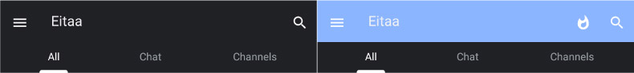

# اصلاح باگ رنگ بالای صفحه اصلی

کاربران ایتا میتوانند با کلیک روی فایل های attheme. داخل پیامرسان؛ تم های طراحی شده توسط دیگران را برای خود اعمال کنند

برخی دستکاری‌ ها در کد های ایتا اعمال شده که باعث میشود رنگ بالای صفحه اصلی به یک رنگ اشتباه تبدیل شود و این قسمت حالت دورنگ پیدا کند:

ا

این باگ در نسخه 6.3.7.7 ایتامُد برطرف شد
