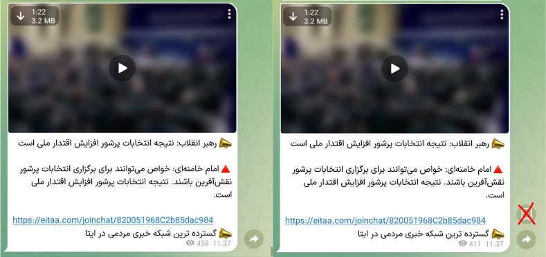
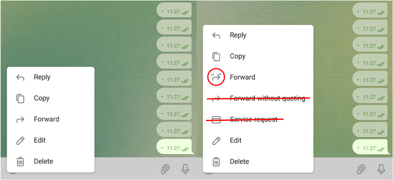
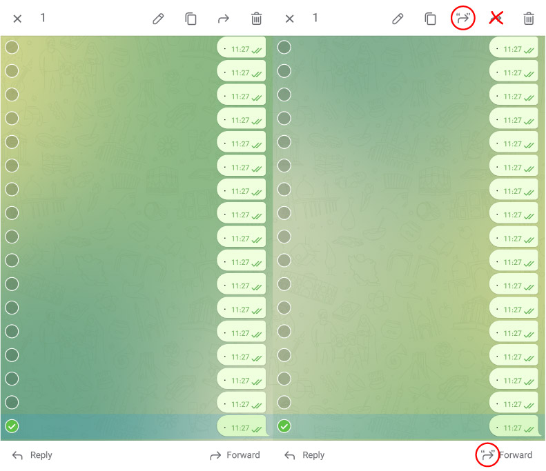

### 1. حذف دکمه ترند های ایتا
ا

### 2. حذف دکمه ذخیره پست در Saved Messages
ا

### 3. حذف دکمه Service request؛ حذف دکمه Forward without Quoting و جایگزینی آیکن‌اش با Forward (مشابه تلگرام)
ا

ا

برای انجام Forward without Quoting میتوانید از گزینه Hide sender's name هنگام فوروارد استفاده کنید:

ا

### 4. حذف دکمه  Eitaa Service از گزینه های چت
ا

(این تغییرات در راستای سادگی و زیبایی بیشتر رابط کاربری انجام شده)
